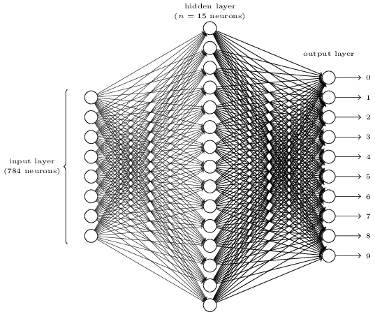
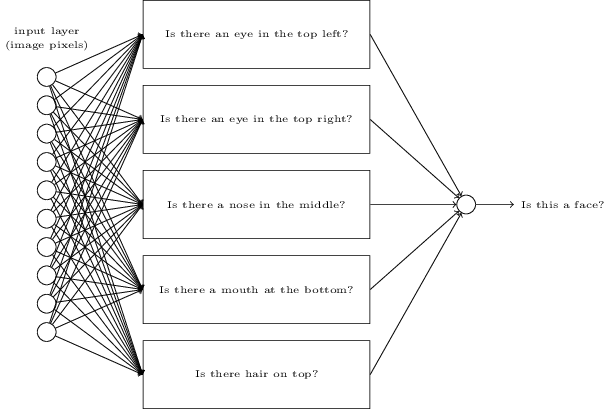

# AI and Machine Learning stuff

## 1. Introduction

Primarily two types of problems, **classification** and **regression** analysis.

**Classification** tasks are important. For example, we might want to classify pictures into a category and automatically add or suggest tags to a user. We can use it to help classify text on a picture as a certain letter or number.

### KEY TERMS

**Observation:** An observation is a data point, typically repersented by a feature vector.

**Feature Extraction:** A process which takes the raw input data (such as an image, metric data generated by a device such as cars etc.) and builds derived values, the features, intended to be informative and non-redundant and for learningand analysis. A simple example would be to extract only metric data (meters, celcius) and not include the redundant data such as feet or fahrenheit. This is a dimensionality reduction process.

**Feature Space/Vector:** A vector that contains different *features* which are individual measurable propertys or characteristics of a phenomenon being observed. Features are commonly numeric, but structural features such as strings and graphs exist (it now depends on how you manipulate this feature in the context of another e.g adding, determining difference etc.)

- **Training Dataset**: The sample of data used to fit the model.
- **Validation Dataset**: The sample of data used to  provide an unbiased evaluation of a model fit on the training dataset  while tuning model hyperparameters. The evaluation becomes more biased  as skill on the validation dataset is incorporated into the model  configuration.
- **Test Dataset**: The sample of data used to provide an unbiased evaluation of a final model fit on the training dataset.

## 2. Algorithms

#### K-means clustering

Used in cluster analysis and good for when we have a lot of unlabeled data and want to group the data with other similar data points into one cluster of **k** clusters. It aims to solve the problem of grouping data into $k$ clusters in such a way that minimizes the within-cluster sum of total variance. 

Standard Algorithm uses an iterative refinement technique. Also referred to as Lloyd's algorithm

Given a set of $k$ means, $m_1^{(1)},…,m_k^{(1)}$ , the algorithm proceeds by alternating two steps until it reaches a satisfactory point.

**Assignment:** Assign each observation to the cluster whose mean has the least squared Euclidean distance, this is intuitively the "nearest" mean. (Mathematically means to partition the observations according to the Voronoi diagram generated by the means)

Each observation $x_p$ is assigned to exactly one cluster $S_i$.

**Update:** Calculate the new means (centroids) of the observations in the new clusters by summing over all the observations $x_p$ in one cluster $S_i$ and dividing the vector by the number of elements in 
$S_i$.

The algorithm converges when the assignments no longer change. The optimality of the clustering is not gained however

This algorithm highly depends on the intial set of $k$ means and how they are determined. There are two basic methods. Randomly select $k$ observations to the be the $k$ means, or randomly assign obvservations to each cluster and perform the update step once to generate the $k$ means.

##### Optimization Techniques:

##### -  K-means++

It attempts to avoid poor seeding for k-means clustering algorithms and avoid poor clusterings. 

1. Choose one center uniformly at random among the observations

2. For each data point $x$, compute $D(x)$, the distance function between $x$ and the nearest center that has been chosen already.

3. Choose one new data point at random as a new center, using a weighted probability distribution where a point $x$ is chosen with probability $D(x)^2$.
4. Repeat steps 2-3 until $k$ centers have been selected
5. Proceed with k-means clustering algorithm with the selected $k-$means.

In experiments, this performed almost always at least as better than standard k-means (random initialization). It generally lowers overall computation despite performing more initially as the better seeding leads to faster convergence. 

Has an expected approximation ratio of $O(\log{k})$, which means the returned solution is within a $O(\log(k))$ factor off of the optimal solution.

#### K-nearest neighbors (KNN)

## 3. Neural Networks

Modeled after the brain and its use of neurons

### 3.1 Perceptrons

Perceptrons are a type of artificial neuron. They take several binary inputs and produce a single binary output.

Nowdays, its more common to use other artificial neurons such as the sigmoid neuron.

A perceptron is has a binary output, a 0 or 1, e.g Is the weather good? 1 = good, 0 = bad.

The final output layer takes a weighted sum of the outputs from the previous layer (its inputs), to make a decision. If the final layer consists of perceptrons, it relies on a threshold to determine a 0 or 1.

$w\cdot x + b ≤ 0$ output 0

$w\cdot x + b > 0$ output 1

### 3.2 Sigmoid Neurons

In order to learn, a step function like the perceptron wouldn't work realistically.

Learning is essentially altering the weights in the network with the goal predicting the test set and unseen data more accurately.

So a small change in weight, should cause a small change in output, not a sharp one as would be with a perceptron.

A sigmoid neuron works like a perceptron, but with a different function

$\sigma{(w\cdot x + b)}$

Where $\sigma{(z)} = \frac{1}{1+e^{-z}}$, the sigmoid function

(Note that $w,x,b$ are vectors)

Due to the differentiability and smoothness of the sigmoid function, small changes in weight will lead to gradual changes in the final output vector.

### 3.3 Architecture

### 

Above is a model of a neural network, with a input layer on the left, output layer on the right, hidden layers in between the input and output layer

When the output of one layer is used as the input for the next, this is known as a **feedforward** neural network. It's like a directed graph. **Recurrent neural networks** are possible, when there are loops in the graph, but have been less influential as as of now, they are less powerful than feedforward.

There's some intuition behind hidden layers. However, it requires experimentation sometimes.

When classifying digits using that MNIST data, it might not be obvious what each hidden neuron contributes to the final decision. This is partly due to how each digit in itself is not very unique anyway compared to other digits when looking at the pixel representation input data.

Classifying digits can be down with a normal neural network (not deep). Backpropagation and gradient descent are more than enough to achieve fairly high accuracy.

The above neural network would work. One might ask why have 10 output layers when 4 output layers should suffice as we can represent digits as binary numbers (1100 = 6)

The main issue is the hidden layers would be 'confused' as to how to alter their weights properly. The minimum cost might not be that small either. Think like a human. What relation do binary numbers have with decimal digits visually? Almost nothing. Hence, it makes no sense to classify in terms of binary numbers. It is possible to take that output layer and then feed it to a 4 neuron layer representing the binary numbers, because now, it makes sense. If we think like a human brain, those output layers are the actual digits, not just the visual image. The actual digit has a mathematical relation to the binary numbers, unlike the pixel image, which likely has a much smaller relation (basically way too complex to relate like the curve in the 6 to the first two one's in its binary representation).

However, suppose we wanted to classify if an image has a face or not.

The rectangle boxes denote sub-networks that use the input data as shown to produce an output (best if it was from an activation function)

These sub-networks can then further be decomposed into more sub-networks as so

Eventually, they will be decomposed enough to the point that our inputs are more than enough data to accurately determine the result of the sub-network, which then contributes to the other sub-networks and the final neural net and make a better decision. Without these sub-networks, the learning algorithm might take much longer to generate the correct weights, and may even be incapable of good classification due to a lack of structure in the hidden layers. Networks with 2 or more hidden layers are called **deep neural networks**.

For deep neural networks, back propagation and stochastic gradient descent, while effective for normal neural networks, trained slowly for deep ones.