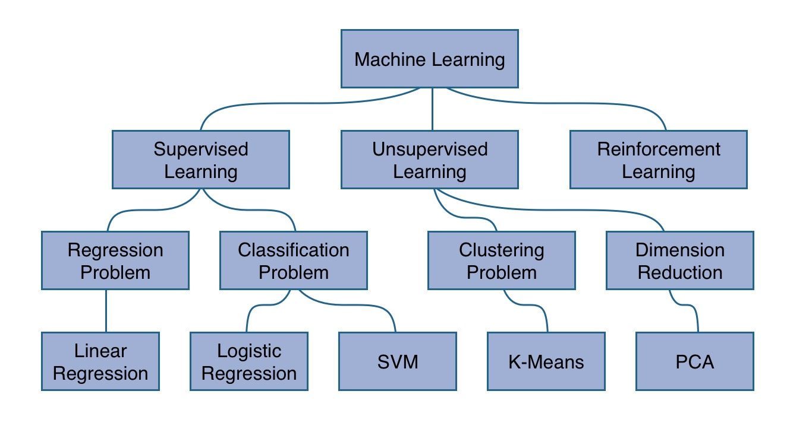

# AI and Machine Learning stuff

## 1. Introduction

Primarily two types of problems, **classification** and **regression** analysis.

**Classification** tasks are important. For example, we might want to classify pictures into a category and automatically add or suggest tags to a user. We can use it to help classify text on a picture as a certain letter or number.

### KEY TERMS

**Observation:** An observation is a data point, typically repersented by a feature vector.

**Feature Extraction:** A process which takes the raw input data (such as an image, metric data generated by a device such as cars etc.) and builds derived values, the features, intended to be informative and non-redundant and for learningand analysis. A simple example would be to extract only metric data (meters, celcius) and not include the redundant data such as feet or fahrenheit. This is a dimensionality reduction process.

**Feature Space/Vector:** A vector that contains different *features* which are individual measurable propertys or characteristics of a phenomenon being observed. Features are commonly numeric, but structural features such as strings and graphs exist (it now depends on how you manipulate this feature in the context of another e.g adding, determining difference etc.)

- **Training Dataset**: The sample of data used to fit the model.
- **Validation Dataset**: The sample of data used to  provide an unbiased evaluation of a model fit on the training dataset  while tuning model hyperparameters. The evaluation becomes more biased  as skill on the validation dataset is incorporated into the model  configuration.
- **Test Dataset**: The sample of data used to provide an unbiased evaluation of a final model fit on the training dataset.

## 2. Algorithms

#### K-means clustering

Used in cluster analysis and good for when we have a lot of unlabeled data and want to group the data with other similar data points into one cluster of **k** clusters. It aims to solve the problem of grouping data into $k$ clusters in such a way that minimizes the within-cluster sum of total variance. 

Standard Algorithm uses an iterative refinement technique. Also referred to as Lloyd's algorithm

Given a set of $k$ means, $m_1^{(1)},…,m_k^{(1)}$ , the algorithm proceeds by alternating two steps until it reaches a satisfactory point.

**Assignment:** Assign each observation to the cluster whose mean has the least squared Euclidean distance, this is intuitively the "nearest" mean. (Mathematically means to partition the observations according to the Voronoi diagram generated by the means)

Each observation $x_p$ is assigned to exactly one cluster $S_i$.

**Update:** Calculate the new means (centroids) of the observations in the new clusters by summing over all the observations $x_p$ in one cluster $S_i$ and dividing the vector by the number of elements in 
$S_i$.

The algorithm converges when the assignments no longer change. The optimality of the clustering is not gained however

This algorithm highly depends on the intial set of $k$ means and how they are determined. There are two basic methods. Randomly select $k$ observations to the be the $k$ means, or randomly assign obvservations to each cluster and perform the update step once to generate the $k$ means.

##### Optimization Techniques:

##### -  K-means++

It attempts to avoid poor seeding for k-means clustering algorithms and avoid poor clusterings. 

1. Choose one center uniformly at random among the observations

2. For each data point $x$, compute $D(x)$, the distance function between $x$ and the nearest center that has been chosen already.

3. Choose one new data point at random as a new center, using a weighted probability distribution where a point $x$ is chosen with probability $D(x)^2$.
4. Repeat steps 2-3 until $k$ centers have been selected
5. Proceed with k-means clustering algorithm with the selected $k-$means.

In experiments, this performed almost always at least as better than standard k-means (random initialization). It generally lowers overall computation despite performing more initially as the better seeding leads to faster convergence. 

Has an expected approximation ratio of $O(\log{k})$, which means the returned solution is within a $O(\log(k))$ factor off of the optimal solution.

#### K-nearest neighbors (KNN)

